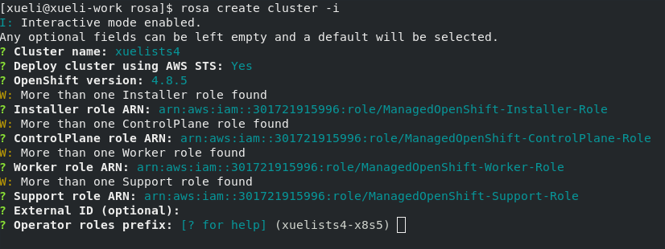
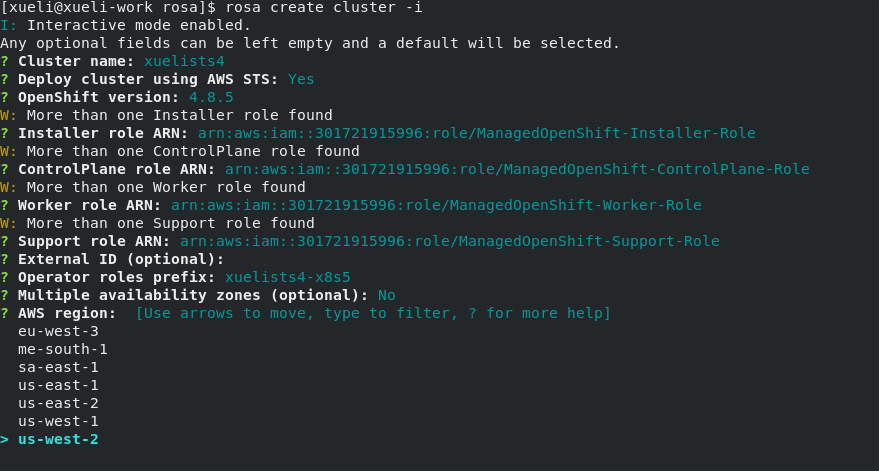

# Setup
```bash
rosa create cluster -i
```

# Test

## Step

Get the latest version of rosacli

## Expect

Support sts from version 1.0.6

## Step

Create rosa account-roles with command
```bash
rosa create account-roles --mode auto -y
```

## Expect

The role on AWS will be prepared successfully

## Step

Create rosa sts cluster in interactive mode via command
```bash
rosa create cluster -i
```

## Expect

The interactive mode should work correctly

## Step

Input cluster name and press enter button

## Expect

There should be "Deploy cluster using AWS STS" showed



## Step

Input and press enter "y" to Deploy cluster using AWS STS:

## Expect

There should be External ID and IAM role names show
- There should be question ask for operator IAM role prefix, cluster name for default value
-The default Installer role ARN should be ManagedOpenShift if it exist
- There should be Support role arn option ask for a support role option
- There should be External ID option
- There should be Master IAm Role ARN
- There should be a Worker IAM Role ARN
- There will be operator-roles prefix generated like "<cluster name>-<random chars>" as default value
- Input illegal IAM roles like "%^&" then the progress will exit with error message that Expect valid IAM role arn
- Only compatible roles are listed. (The role is compatible with the old version)
- The 'Deploy cluster using AWS STS' should be default with 'yes'
- The machinetype should be listed with the order of ("category asc"),'https://api.stage.openshift.com/api/clusters_mgmt/v1/machine_types?order=category+asc&page=1&search=cloud_provider.id+%3D+%27aws%27&size=100'" and set m5.xlarge as default
- Default machine pool labels (optional): [? for help] is shown. Apply the default (no label by clicking Enter)



## Step

Input the correct values and other required options

## Expect

The cluster will be created successfully

## Step

Describe the cluster

## Expect

The OIDC Endpoint URL showed

## Step

Create cluster with skip "Role ARN (optional)"

## Expect

Then no External ID and Operator IAM role names show in next options.
Only the classic installer role are shown while HCP installer role should NOT be shown

## Step

Create cluster with '--sts'
```bash
rosa create cluster --sts
```

## Expect

The interactive mode should be prompted.
After choose all options, the command of creating cluster should be prompted with '--sts' flag.
```
I: To create this cluster again in the future, you can run:
rosa create cluster --cluster-name yw-1025-psts4 --sts --role-arn arn:aws:iam::301721915996:role/haha-Installer-Role --support-role-arn arn:aws:iam::301721915996:role/haha-Support-Role --controlplane-iam-role arn:aws:iam::301721915996:role/haha-ControlPlane-Role --worker-iam-role arn:aws:iam::301721915996:role/haha-Worker-Role --operator-roles-prefix yw-1025-psts4-n2b5 --region us-west-2 --version 4.9.0 --compute-nodes 2 --machine-cidr 10.0.0.0/16 --service-cidr 172.30.0.0/16 --pod-cidr 10.128.0.0/14 --host-prefix 23
```

## Step

Create one ocm-role then create sts cluster

## Expect

The cluster should be created successfully.
OCM should user ocm-role to verify operator roles and OIDC provider,see service log 'Using '<ocm-role>' to validate operator roles'
