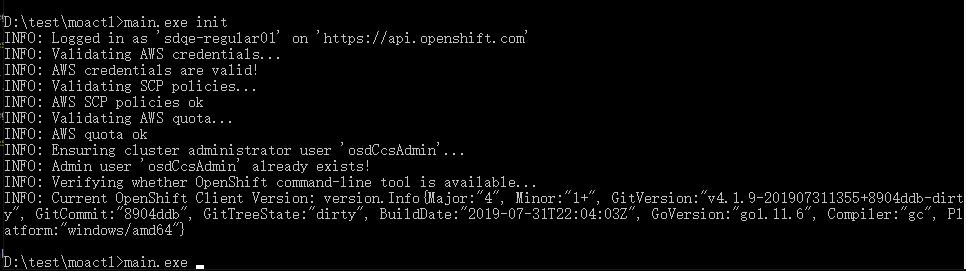

# Test

## Step
Login with the rosa cti and prepare one ready cluster(no private)

## Expect

## Step
Check the help message of 'rosa edit cluster -h'

## Expect
\# ./rosa edit cluster -h  
Edit cluster.  
  
Usage:  
rosa edit cluster [flags]  
  
Examples:  
\# Edit a cluster named "mycluster" to make it private  
rosa edit cluster mycluster --private  
  
\# Edit all options interactively  
rosa edit cluster -c mycluster --interactive  
  
Flags:  
-c, --cluster string Name or ID of the cluster to edit.  
--private Restrict master API endpoint to direct, private connectivity.  
-h, --help help for cluster  
  
Global Flags:  
--debug Enable debug mode.  
-i, --interactive Enable interactive mode.  
--profile string Use a specific AWS profile from your credential file.  
-v, --v Level log level for V logs

## Step
Edit the cluster by the command.  
1. edit the '--private'  
2. without the cluster_id  
3.with the incorrect cluster_id

## Expect
1. The cluster is changed to 'private'  
2.E: Expected exactly one command line argument or flag containing the name or identifier of the cluster  
3.E: Failed to get cluster '1iekajbm5j6ps8hh5ddjdpe64880c1q6aaaa': There is no cluster with identifier or name '1iekajbm5j6ps8hh5ddjdpe64880c1q6aaaa'

## Step
Repeat the steps on Windows

## Expect
- There will be no color for the output  

