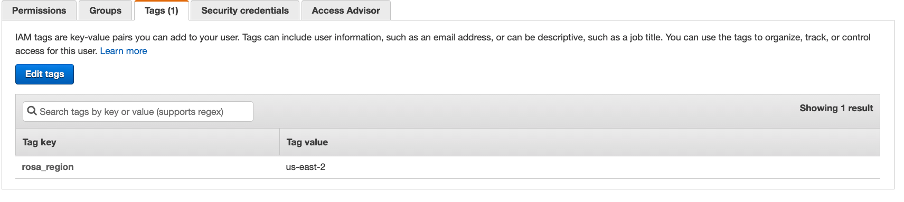
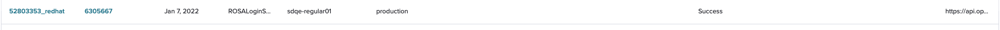

# Test

## Step
Prepare the rosa tool and check the help message of 'rosa init -h'

## Expect
\# ./rosa init -h  
Applies templates to support Red Hat OpenShift Service on AWS. If you are not  
yet logged in to OCM, it will prompt you for credentials.  
  
Usage:  
rosa init [flags]  
  
Examples:  
\# Configure your AWS account to allow ROSA clusters  
rosa init  
  
\# Configure a new AWS account using pre-existing OCM credentials  
rosa init --token=$OFFLINE_ACCESS_TOKEN  
  
Flags:  
-r, --region string AWS region in which verify quota and permissions (overrides the AWS_REGION environment variable)  
--delete-stack Deletes stack template applied to your AWS account during the 'init' command.  
  
--client-id string OpenID client identifier. The default value is 'cloud-services'.  
--client-secret string OpenID client secret.  
--insecure Enables insecure communication with the server. This disables verification of TLS certificates and host names.  
--scope strings OpenID scope. If this option is used it will replace completely the default scopes. Can be repeated multiple times to specify multiple scopes. (default [openid])  
-t, --token string Access or refresh token generated from https://cloud.redhat.com/openshift/token/rosa.  
--token-url string OpenID token URL. The default value is 'https://sso.redhat.com/auth/realms/redhat-external/protocol/openid-connect/token'.  
-h, --help help for init  
  
Global Flags:  
--debug Enable debug mode.  
--profile string Use a specific AWS profile from your credential file.  
-v, --v Level log level for V logs

## Step
Run 'rosa init'

## Expect
I: Logged in as 'sdqe-regular02' on 'https://api.stage.openshift.com'  
I: Validating AWS credentials...  
I: AWS credentials are valid!  
I: Validating SCP policies...  
I: AWS SCP policies ok  
I: Validating AWS quota...  
I: AWS quota ok  
I: Ensuring cluster administrator user 'osdCcsAdmin'...  
I: Admin user 'osdCcsAdmin' already exists!  
I: Validating SCP policies for 'osdCcsAdmin'...  
I: AWS SCP policies ok  
I: Validating cluster creation...  
I: Cluster creation valid  
I: Verifying whether OpenShift command-line tool is available...  
W: OpenShift command-line tool is not installed.  
  
The init procedure will add the region tag on the osdCcsAdmin User. The region tag will use the default region in the aws config if there is no --region specified  
  
If there is no cloudformation, a new one will be created in the region which specified with '--region'/config  
If it meets error during the init, will prompt some error message.  
  
Init with the region which is not same with the IAM user tag, it should be successful  
Init with --profile should works well. The init process will use the config and credential of the profile value.

## Step
Run 'rosa version'

## Expect
The version should be shown correctly

## Step
Run 'rosa init --delete-stack'

## Expect
The stack will be deleted successfully.  
If the '--region' flag is used and same with the tag for the user, it will delete the stack in that region.   
If the '--region' flag is used but not same with the tag for the user, it will delete the stack of the user tag.  
If the '--region' flag is not used, it will delete the the stack in the default region 'us-east-1'

## Step
Run 'rosa init --disable-scp-checks'

## Expect
I: Logged in as 'sdqe-regular01' on 'https://api.stage.openshift.com'  
I: Validating AWS credentials...  
I: AWS credentials are valid!  
I: Skipping AWS SCP policies check  
I: Validating AWS quota...  
I: AWS quota ok  
I: Ensuring cluster administrator user 'osdCcsAdmin'...  
I: Admin user 'osdCcsAdmin' already exists!  
I: Validating SCP policies for 'osdCcsAdmin'...  
I: AWS SCP policies ok  
I: Validating cluster creation...  
I: Cluster creation valid  
I: Verifying whether OpenShift command-line tool is available...  
I: Current OpenShift Client Version: version.Info{Major:"4", Minor:"1+",

## Step
Init with '--dry-run' flag.

## Expect
It should be created successfully.  
There is no quota occupied.  
\#rosa create cluster --cluster-name dyr-test --dry-run  
I: Creating cluster 'dyr-test' should succeed. Run without the '--dry-run' flag to create the cluster.

## Step
Download the ocm tool by the rosa tool.  
\# rosa download openshift-client

## Expect
The openshift-client should be downloaded.

## Step
Check the user info by "rosa whoami"

## Expect
When users is not logged in:  
\# ./rosa whoami  
E: User is not logged in to OCM  
After log in:  
\# ./rosa whoami  
AWS Account ID: 301721915996  
AWS Default Region: us-east-2  
AWS ARN: arn:aws:iam::301721915996:user/yuwan  
OCM API: https://api.stage.openshift.com  
OCM Account ID: 1Pg91NjVkaKuxDvnp9iXQa8MlC3  
OCM Account Name: sdqe-regular01 Green  
OCM Account Username: sdqe-regular01  
OCM Account Email: yasun+regular01@redhat.com  
OCM Organization ID: 1OAqHo0k19kyq7Xt7I1Zqb8Ok4K  
OCM Organization Name: Red Hat-Service Delivery-tester  
OCM Organization External ID: 12553207

## Step
Check 'rosa login'

## Expect
There is an event recorded on Pendo,  
  
The help message should be show as bellow:  
\# ./rosa login -h  
Log in to your Red Hat account, saving the credentials to the configuration file.  
The supported mechanism is by using a token, which can be obtained at: https://cloud.redhat.com/openshift/token/rosa  
  
The application looks for the token in the following order, stopping when it finds it:  
1. Command-line flags  
2. Environment variable (ROSA_TOKEN)  
3. Environment variable (OCM_TOKEN)  
4. Configuration file  
5. Command-line prompt  
  
Usage:  
rosa login [flags]  
  
Examples:  
\# Login to the OpenShift API with an existing token generated from https://cloud.redhat.com/openshift/token/rosa  
rosa login --token=$OFFLINE_ACCESS_TOKEN  
  
Flags:  
--client-id string OpenID client identifier. The default value is 'cloud-services'.  
--client-secret string OpenID client secret.  
-h, --help help for login  
--insecure Enables insecure communication with the server. This disables verification of TLS certificates and host names.  
--scope strings OpenID scope. If this option is used it will replace completely the default scopes. Can be repeated multiple times to specify multiple scopes. (default [openid])  
-t, --token string Access or refresh token generated from https://cloud.redhat.com/openshift/token/rosa.  
--token-url string OpenID token URL. The default value is 'https://sso.redhat.com/auth/realms/redhat-external/protocol/openid-connect/token'.  
--use-auth-code Login using OAuth Authorization Code. This should be used for most cases where a browser is available.  
--use-device-code Login using OAuth Device Code. This should only be used for remote hosts and containers where browsers are not available. Use auth code for all other scenarios.(from OCM-5736)  
  
  
Global Flags:  
--debug Enable debug mode.  
--profile string Use a specific AWS profile from your credential file.  
-v, --v Level log level for V logs  
Login with the rosa cli tool.  
1. use Environment variable (ROSA_TOKEN)  
2. Use Environment variable (OCM_TOKEN)  
3.Command-line flags  
4.Configuration file  
5.Command-line prompt  
  
It should be successful to login.  
I: Logged in as 'sdqe-regular01' on 'https://api.stage.openshift.com'  
The token should be stored in ocm.jsom file in the bellow location:  
Linux ~/.config/ocm/ocm.json  
Windows %APPDATA%/ocm/ocm.json  
Mac ~/Library/Application Support/ocm/ocm.json  
  
Note: there is a hidden flag --use-auth-code supported after 1.2.33(not include)  
after using this flag, do not need input the token and there is a browser tab opened to login with Red Hat SSO.  
browser shows "Login successful! Please close this window and return back to CLI" after succeed  
```$ ./rosa login --use-auth-code --env=staging  
You will now be redirected to Red Hat SSO login  
Token received successfully  
I: Logged in as 'tzhou5' on 'https://api.stage.openshift.com'```

## Step
Check "rosa login --use-device-code"

## Expect
This is a hidden flag which not shown in the --help message, supported from OCM-5815  
after using this flag, user should follow the step mentioned in the response: access <https://sso.redhat.com/device> and enter the code in browser  
```  
./rosa login --use-device-code  
I: To login, navigate to https://sso.redhat.com/device on another device and enter code DCKY-MMCO  
I: Checking status every 5 seconds...  
I: Logged in as 'sdqe-rosa' on 'https://api.openshift.com'  
I: To switch accounts, logout from https://sso.redhat.com and run `rosa logout` before attempting to login again  
  
```  
after valid code entered, the browser shows successfully. close the browser then login successful in the terminal.  
  
If the code is not input on the auth page for a long time, rosacli will return error "E: An error occurred while polling for token exchange: error exchanging for token: context deadline exceeded  
"  
- After login without error, execute some command to make sure it works well, `rosa whoami` `rosa list cluster`

## Step
Log out.

## Expect
\#rosa logout  
There is no error.  
All other command should not work with the same error message 'E: User is not logged in to OCM'

## Step
Repeat step1~2 with below flags:  
1.--region  
2. --token-url --client-id --client-secret --insecure --scope  
3. --token

## Expect
1. The region info will overwrite the one in config  
2. it should work well as step2  
3. It should overwrite the token input during login  
4. After login without error, execute some command to make sure it works well, `rosa whoami` `rosa list cluster`
