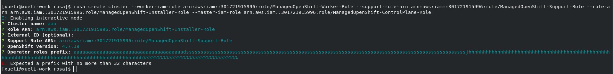

# Setup
```bash
rosa create cluster -c ${name}aa --region ${region} --version ${version}-${channel_group} --channel-group ${channel_group} --role-arn arn:aws:iam::${aws_account_id}:role/OSDCCSAdmin --tags cluster-name:${name},cluster-version:${version}-${channel_group} ${roles}
```

# Test

## Step
Get the latest version of rosacli

## Expect
Support sts from version 1.0.6

## Step
Prepare sts account roles with command
```bash
rosa create account-roles --mode auto -y --version 4.8
```

## Expect
The role on AWS will be prepared successfully

## Step
Run command to create sts rosa cluster with longer than 32 operator prefix
```bash
rosa create cluster -c ${name}aa --operator-roles-prefix="iamlongerthan32charactersiamlongerthan32characters"
```

## Expect
There should be correct error message output


## Step
Run command to create sts rosa cluster with "illegal" operator prefix
```bash
rosa create cluster -c ${name}aa --operator-roles-prefix="^^^%%%###@@@"
```

## Expect
There should be correct error message output

## Step
Run command to create sts rosa cluster with illegal role_arn
```bash
rosa create cluster -c ${name}aa --role-arn illegalrolearn --operator-iam-roles=$roles
```

## Expect
There should be correct error message output

## Step
~~Run command without operator-role-prefix set $ rosa create $ rosa create cluster \ --master-iam-role arn:aws:iam::301721915996:role/ManagedOpenShift-ControlPlane-Role \ --worker-iam-role arn:aws:iam::301721915996:role/ManagedOpenShift-Worker-Role \ --support-role-arn arn:aws:iam::301721915996:role/ManagedOpenShift-Support-Role \ --role-arn arn:aws:iam::301721915996:role/ManagedOpenShift-Installer-Role~~

## Expect
~~It will go to interactive mode to ask user to input operator role prefix~~

# Cleanup
SDA-4534
